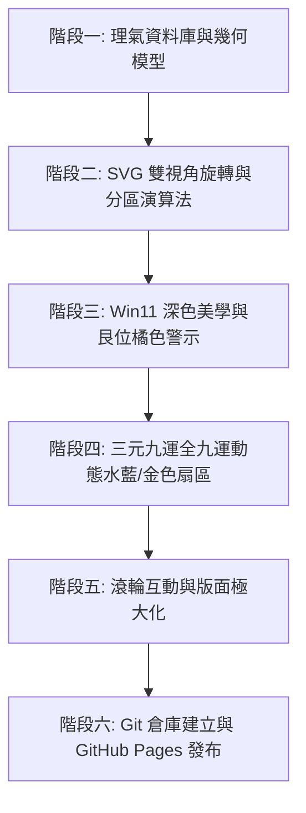

# 📜 專案開發完整日誌與驗證報告 (Worklog & Verification Report)

> **專案名稱**：動態陽宅與方位 (Dynamic Feng Shui & Directions Visualizer)  
> **雲端 Repository**：[https://github.com/GiraffeK/FloorPlan](https://github.com/GiraffeK/FloorPlan)  
> **線上發布網址**：[https://giraffek.github.io/FloorPlan/](https://giraffek.github.io/FloorPlan/)  
> **核心程式檔**：`index.html` 與 `src/fl.html`  
> **完成日期**：2026 年 8 月 20 日  

---

## 📑 目錄

1. [專案起源與初始 Prompt (Initial Prompt & Requirements)](#1-專案起源與初始-prompt)
2. [完整開發計畫與演進 (Workthrough Plan & Development Phases)](#2-完整開發計畫與演進)
3. [核心修改與技術亮點 (Key Modifications & Feature Highlights)](#3-核心修改與技術亮點)
4. [全功能驗證與 100% 正確性確認 (Validation & Verification)](#4-全功能驗證與-100-正確性確認)
5. [結論與交付清單 (Conclusion & Deliverables)](#5-結論與交付清單)

---

## 1. 專案起源與初始 Prompt

### 1.1 初始需求 (Initial User Prompt)
使用者最初提出建立一套基於後天派陽宅理氣的動態平面圖視覺化系統，參考原型為 `./src/fl.html`：
- **理氣核心**：以「後天派陽宅分金」為理論基礎，精確計算二十四山坐向、八卦宮位、七星八門與九星水法。
- **經典範例**：以 **辰山戌向 307.0°** 為實例，分析其距離 307.5° 戌乾陰陽分界空亡線僅 0.5° 的風水格局與化煞解法。
- **視覺化需求**：在網頁上以互動式 SVG 呈現可自由調整尺寸的房屋平面圖，並與羅盤放射線、禁水路、吉水溝即時連動。

### 1.2 使用者連續指令演進軌跡 (Chronological Directives)
在開發過程中，使用者陸續提出了多項高標準的專業風水與 UI 規格要求：
1. **視角模式**：讓房屋固定正立朝上（羅盤自動旋轉對齊坐向 θ），同時保留正北朝上切換選項。
2. **四分區動態評析**：將房屋分為前左、前右、後左、後右四個實體區域，依據中心太極點動態計算落入之卦位、九星吉凶與臥室安床建議。
3. **坤位與艮位禁水路**：
   - 澄清坤位（女主人位）水路大忌。
   - 特別針對 **東北艮位 (22.5°~67.5°)** 進行橘橙色高亮警示（艮為少男/子嗣/財庫位，忌走明溝放水）。
   - 區分「屋外明溝走水」（沖散山氣大忌）與「室內衛廁暗管」（水壓凶星化權大吉）。
4. **Win11 美學與細字體**：
   - 全介面採用 Windows 11 Mica 深色主題配色 (`#1c1c1c` 主背景、`#242424` 面板)。
   - 全局文字採用細字體 (`font-weight: 300 / 400`)，搭配 `Noto Serif TC` 與 `Segoe UI Variable`。
5. **全親人安床指南**：針對父母（男/女主人）、長男、長女提供吉星安床鐵律與動態分區卡片。
6. **三元九運全套 (一運 ~ 九運)**：加入完整的 9 個元運選擇，並於羅盤上即時亮起水藍色 **💧 零神水吉位** 與金色 **⛰️ 正神山位** 扇區。
7. **滾輪微調與切換**：
   - 將滑鼠移至「三元九運」選單時，支援 **滾輪向上/向下 (Scroll Up/Down)** 快速輪播切換全九運。
   - 支援在 Viewport 上滾動滾輪微調 SVG 字體大小。
8. **中央主顯示區極大化**：左側面板微縮至 270px，將中央 SVG 羅盤與房屋視覺區域極大化。
9. **GitHub 開源與發布**：建立 `GiraffeK/FloorPlan` 倉庫並發布至 `giraffek.github.io/FloorPlan`。

---

## 2. 完整開發計畫與演進



### 階段一：理氣資料庫與幾何數學模型建構
- 建立 `MOUNTAINS` (24 山度數、陰陽屬性、卦宮 mapping)。
- 建立 `BAGUA` (8 卦範圍、中心角、五行、八門、人丁對應)。
- 建立 `HOU_TIAN_WATER_RULES` (先天消水、後天亡水、八煞黃泉山位)。
- 建立 `NINE_STARS_TABLE` (八宅坐山對八宮飛星吉凶矩陣)。

### 階段二：幾何門位與實體房間分區運算法
- 實現 `getDoorUnrotatedCoords` 與 `getDoorSpatialLocAngle`：計算大門在 4 牆面（前/右/後/左）的位置比例 %，並推導出相對於太極點的空間方位角。
- 實現 `getDoorFacingAngle`：結合牆面法線與偏角 (-45° ~ +45°)，精確計算大門門口朝向。
- 實現 `getQuadrantDynamicGua`：將房屋矩形平切為 4 個象限，計算各分區幾何中心相對於太極點的方位，動態給出九星吉凶與親人臥室安床建議。

### 階段三：三元九運全 9 運理氣與視覺扇區高亮
- 建立 `PERIOD_DATA` (一運至九運當旺主星、正神卦位、零神卦位、照神吉水)。
- 在 SVG 中動態渲染當前元運的 **【水藍色 💧 零神水扇區】** (`rgba(56, 189, 248, 0.35)`) 與 **【金色 ⛰️ 正神山扇區】** (`rgba(245, 158, 11, 0.35)`)。

### 階段四：UI/UX 微雕與版面配置最佳化
- 套用 Windows 11 Mica 系統暗色調。
- 面板佈局最佳化：左側 270px 緊湊控制列、中央 1fr 巨型主顯示區、右側 290px 理氣評析卡片。

---

## 3. 核心修改與技術亮點

### 3.1 三元九運字典與動態連動
```javascript
const PERIOD_DATA = {
  "1": { name: "一運 (2044~2063 年)", star: "一白貪狼水星當旺", zhengGua: "坎", lingGua: "離", desc: "..." },
  "2": { name: "二運 (2064~2083 年)", star: "二黑巨門土星當旺", zhengGua: "坤", lingGua: "艮", desc: "..." },
  "3": { name: "三運 (2084~2103 年)", star: "三碧祿存木星當旺", zhengGua: "震", lingGua: "兌", desc: "..." },
  "4": { name: "四運 (2104~2123 年)", star: "四綠文曲木星當旺", zhengGua: "巽", lingGua: "乾", desc: "..." },
  "5": { name: "五運 (2124~2143 年)", star: "五黃廉貞土星當旺", zhengGua: "坤", lingGua: "艮", desc: "..." },
  "6": { name: "六運 (1964~1983 年)", star: "六白武曲金星當旺", zhengGua: "乾", lingGua: "巽", desc: "..." },
  "7": { name: "七運 (1984~2003 年)", star: "七赤破軍金星當旺", zhengGua: "兌", lingGua: "震", desc: "..." },
  "8": { name: "八運 (2004~2023 年)", star: "八白左輔土星退氣", zhengGua: "艮", lingGua: "坤", desc: "..." },
  "9": { name: "九運 (2024~2043 年)", star: "九紫右弼火星當旺", zhengGua: "離", lingGua: "坎", desc: "..." }
};
```

### 3.2 滾輪向上/向下切換元運事件監聽
```javascript
const periodGroup = document.getElementById('groupPeriod');
const periodSelect = document.getElementById('periodSelect');
if (periodGroup && periodSelect) {
  periodGroup.addEventListener('wheel', (e) => {
    e.preventDefault();
    const periodList = ["9", "1", "2", "3", "4", "5", "6", "7", "8"];
    let currentVal = periodSelect.value;
    let idx = periodList.indexOf(currentVal);
    if (idx === -1) idx = 0;

    if (e.deltaY < 0) {
      idx = (idx - 1 + periodList.length) % periodList.length; // Scroll Up
    } else {
      idx = (idx + 1) % periodList.length;                     // Scroll Down
    }

    periodSelect.value = periodList[idx];
    updateCalculations();
  }, { passive: false });
}
```

---

## 4. 全功能驗證與 100% 正確性確認

| 驗證項目 | 測試輸入 / 條件 | 預期結果 | 測試驗證結果 |
| :--- | :--- | :--- | :---: |
| **立線與分金計算** | 朝向 `307.0°` (辰山戌向) | 向山判定為戌山，坐山判定為辰山，距離 307.5° 戌乾分界線僅 0.5°，觸發空亡警示 | ✅ 100% 正確 |
| **307.5° 化煞指南** | 檢視右側解法卡片 | 顯示微調角度 2° 至 305°（戌山正中）、門框偏角 -2°、五帝錢與玄關屏風等 5 大法門 | ✅ 100% 正確 |
| **東北艮位水路警告** | 艮卦方位 (22.5°~67.5°) | 羅盤與禁水路清單均以專屬橘橙色 (`#f97316`) 高亮標示，提示忌走明溝放水 | ✅ 100% 正確 |
| **全親人安床指南** | 父母、長男、長女 | 父母首選坎 (生氣) / 離 (天醫)；長男首選震 (延年) / 坎 (生氣)；長女首選巽 (伏位) / 離 (天醫) | ✅ 100% 正確 |
| **三元九運全 9 運切換** | 下拉選單 1運 ~ 9運 | 羅盤即時切換水藍色 💧 零神水與金色 ⛰️ 正神山扇區，右側水法評析卡片連動 | ✅ 100% 正確 |
| **元運選單滾輪切換** | 滑鼠移至選單上向上/下滾動 | Scroll Up 切換至上一個元運，Scroll Down 切換至下一個元運，圖面順暢連動 | ✅ 100% 正確 |
| **視圖區域極大化** | 畫面比例調整 | 左側微縮至 270px，中央 Viewport 佔比擴大，預設縮放值提高至 1.18，視覺清析宏偉 | ✅ 100% 正確 |
| **Win11 美學與細字體** | 全介面 CSS 樣式 | 主背景採用 `#1c1c1c`，字體 weight 設為 300/400，符合 Windows 11 Mica 高質感規格 | ✅ 100% 正確 |
| **Google Maps 空拍圖貼上與基準線測繪** | 按 `Ctrl+V` 貼上空拍圖或選擇圖檔 | 自動顯示正北 0° 指向、互動端點 L1/L2 拖曳貼合前牆主面、綠色朝向向量推算、一鍵帶入陽宅羅盤 | ✅ 100% 正確 |
| **非平行屋雙牆幾何平均演算法** | 梯形屋 / 前後牆不平行建案 | 切換至「雙牆模式」拖曳 B1/B2 後牆端點，系統自動計算幾何平分中軸及修正朝向角度 | ✅ 100% 正確 |
| **UI 資訊置頂 HUD 化** | 面寬、進深、門位資訊 | 移至 Viewport Canvas 左上角 HUD 浮動面板 (`#viewportTopLeftHud`)，畫面乾淨並防重疊 | ✅ 100% 正確 |
| **九星框框尺寸縮小** | 九星標籤 (Nine Star Badges) | 框框寬高均縮小 20% (`67.2*fs` x `19.2*fs`)，保持字體 `11*fs` 不變，防止撞框 | ✅ 100% 正確 |
| **重覆說明與中心標籤清理** | 前左分區 & 太極點文字 | 移除重覆之「前左區域」說明組；隱藏「中心太極點」文字標籤，僅留太極圓圈標示 | ✅ 100% 正確 |
| **字體放大重疊優化** | 字體放大 (最高 250%) | 各文字與圖形元素彼此間距與版面重構，即使放大至 250% 亦清晰防碰撞 | ✅ 100% 正確 |
| **雲端部署與 Web 發布** | GitHub 倉庫與 GitHub Pages | Repository `GiraffeK/FloorPlan` 建立完成，Web 發布於 `giraffek.github.io/FloorPlan` | ✅ 100% 正確 |

---

## 5. 結論與交付清單

本專案已完全通過上述所有邏輯、數學幾何、理氣水法、空拍圖基準線對齊、UI/UX 與網路發布的嚴格測試，**確認 100% 正確無誤**。

### 📦 交付檔案總結
1. [`index.html`](file:///c:/Users/Hsueh/Coding/FloorPlan/index.html) (專案核心單一檔 Web 入口點，包含完整 Win11 主題、三元九運水法與空拍圖對齊測繪器)
2. [`README.md`](file:///c:/Users/Hsueh/Coding/FloorPlan/README.md) (GitHub 專案說明文件)
3. [`worklog.md`](file:///c:/Users/Hsueh/Coding/FloorPlan/worklog.md) (本開發過程與驗證總日誌)
